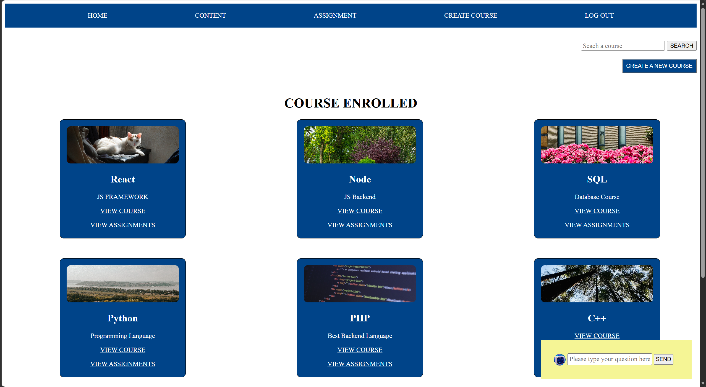
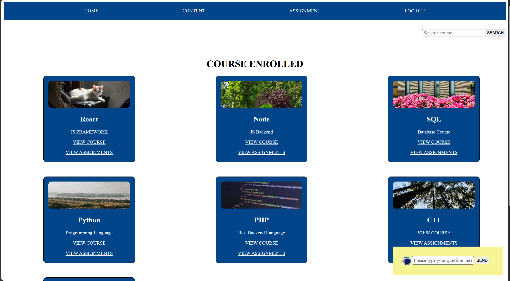
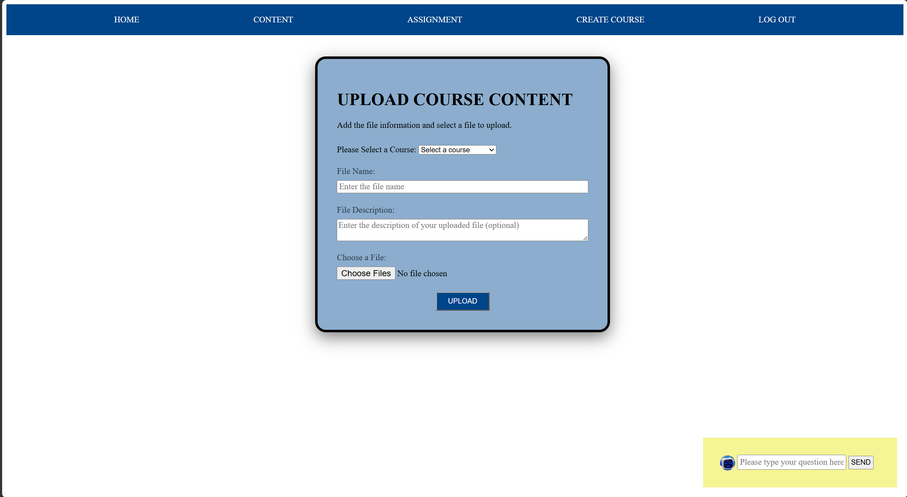
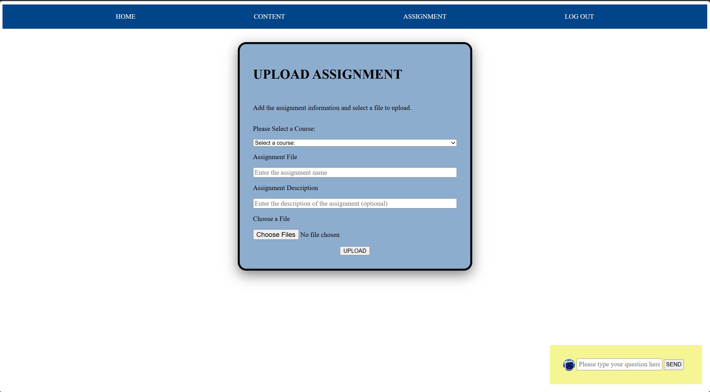
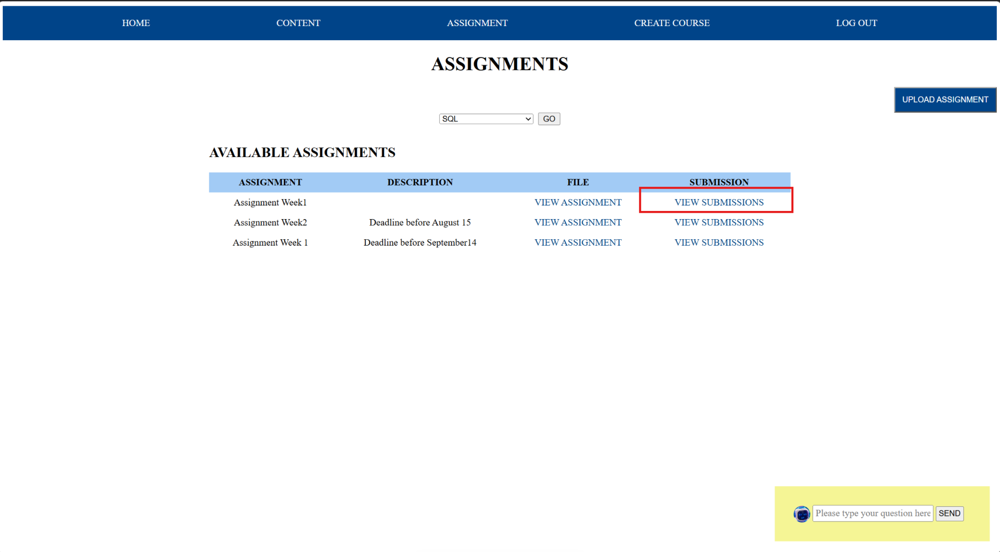
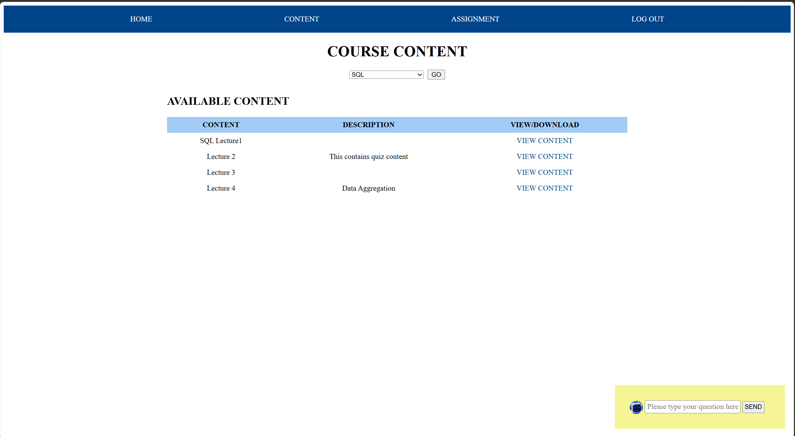
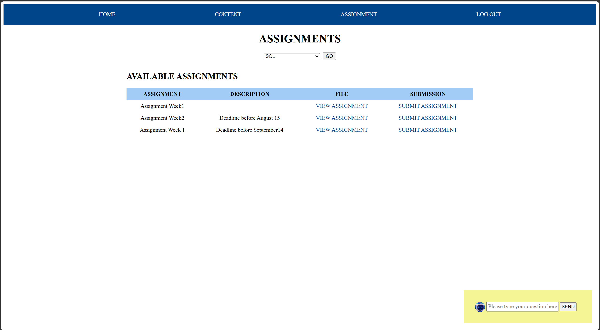
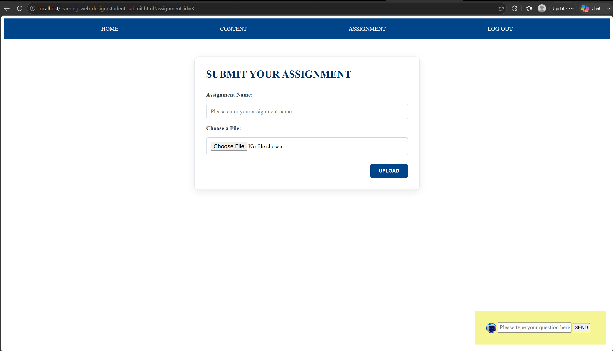
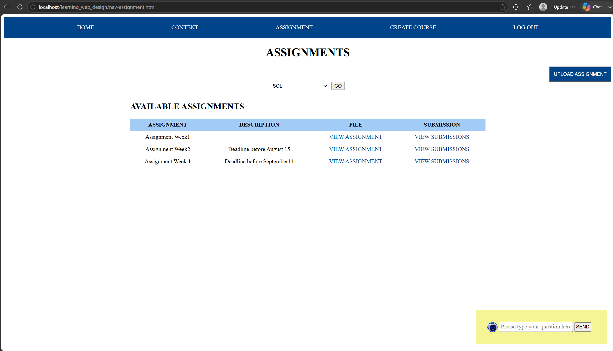
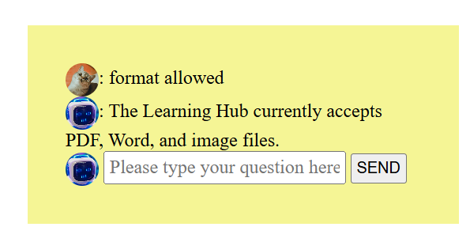

# Learning Hub

Learning Hub is a small full-stack learning platform prototype built to explore how course content, assignments, user roles, and student submissions can work together in a simple learning environment.

The project includes separate teacher and student workflows and uses a PHP/MySQL backend with a JavaScript/jQuery front end.

## Features

### Teacher workflow
- Sign in with a teacher account
- Create courses
- Upload course resources
- Upload assignments
- View student submissions

### Student workflow
- Sign in with a student account
- Browse available courses
- View course resources and assignments
- Submit assignment files

### Shared features
- Session-based login
- Role-aware navigation
- Course search
- Dynamic content loaded through Fetch API calls
- File upload workflows
- Simple built-in help chatbot

## Tech Stack

- HTML5
- CSS3
- JavaScript
- jQuery
- Fetch API
- PHP
- MySQL
- PDO prepared statements
- WAMP for local development

## Project Structure

```text
learning_web_design/
├── api/                  # PHP endpoints, authentication, and database access
├── images/               # Course and chatbot images
├── scripts/              # Front-end JavaScript/jQuery
├── styles/               # Shared CSS
├── assignment-uploads/   # Runtime assignment files (not committed)
├── submits/              # Runtime student submissions (not committed)
├── uploads/              # Runtime course-content uploads (not committed)
├── database/             # Database schema and optional demo seed data
└── *.html                # Main application pages
```

## Application Flow

The browser interface sends requests to PHP endpoints using the Fetch API. PHP handles authentication, authorization, file processing, and database operations, then returns JSON responses to the front end.

```text
HTML/CSS + JavaScript/jQuery
            ↓
         Fetch API
            ↓
        PHP endpoints
            ↓
           MySQL
```

Teacher-only actions such as creating courses, uploading learning materials, uploading assignments, and viewing submissions are checked on the server before the request is processed.

## Local Setup

This project was developed for a local WAMP environment.

1. Install and start WAMP (Apache and MySQL).
2. Place the project folder inside your WAMP `www` directory.
3. Create the database by importing `database/schema.sql` in phpMyAdmin.
4. Optional: import `database/seed.sql` to add local demo accounts.
5. Copy `api/db.example.php` to `api/db.php`.
6. Update the database values in `api/db.php` if your local MySQL configuration is different.
7. Open the project through your local Apache server, for example:

```text
http://localhost/learning_web_design/login.html
```

### Demo accounts

If you import `database/seed.sql`:

- Teacher: `Gina` / `123456`
- Student: `Bibi` / `mynameisbibi`

These accounts are intended only for local demonstration.

## Screenshots

### Role-Based Experience

The interface adapts to the authenticated user's role. Teachers can create and manage learning activities, while students access enrolled courses, course content, and assignments.

<table>
  <tr>
    <td width="50%">
      <strong>Teacher Dashboard</strong><br><br>
      
    </td>
    <td width="50%">
      <strong>Student Dashboard</strong><br><br>
      
    </td>
  </tr>
</table>


### Teacher Course and Assignment Management

Teachers can upload course resources, create assignments, review existing assignments, and access student submissions.



<table>
  <tr>
    <td width="50%">
      <strong>Upload Assignment</strong><br><br>
      
    </td>
    <td width="50%">
      <strong>Manage Assignments</strong><br><br>
      
    </td>
  </tr>
</table>


### Student Learning and Submission Workflow

Students can select a course, access available learning resources and assignments, and submit assignment files.

<table>
  <tr>
    <td width="50%">
      <strong>View Course Content</strong><br><br>
      
    </td>
    <td width="50%">
      <strong>View and Submit Assignments</strong><br><br>
      
    </td>
  </tr>
</table>

Students submit files through the assignment submission workflow.




### Teacher Submission Review

Submitted work can be reviewed through the teacher interface, completing the assignment workflow.

<table>
  <tr>
    <td width="50%">
      <strong>Teacher View All Uploaded Assignment</strong><br><br>
     
    </td>
    <td width="50%">
      <strong>Teacher View All Student Submission for Each Assignment</strong><br><br>
      
    </td>
  </tr>
</table>


   


### Additional Feature: Rule-Based Chatbot

A lightweight rule-based chatbot provides quick responses to common questions about the Learning Hub, including supported file formats.



## What I Focused On

I built this project to practice the development side of learning technology, particularly the connection between front-end interfaces and back-end learning workflows. The main focus was on role-based experiences, course and assignment management, file handling, and moving data between the browser, PHP endpoints, and MySQL.

## Portfolio Scope

This is a portfolio prototype rather than a production LMS. A production version would need additional hardening, including stricter file validation, CSRF protection, broader authorization checks, output escaping, environment-based configuration, automated testing, and additional responsive/accessibility testing.

## Possible Next Steps

- Improve responsive layouts for smaller screens
- Add assignment status and grading workflows
- Add richer accessibility testing
- Add automated tests for API endpoints
- Add stronger upload validation and security controls
- Add a hosted demo environment
